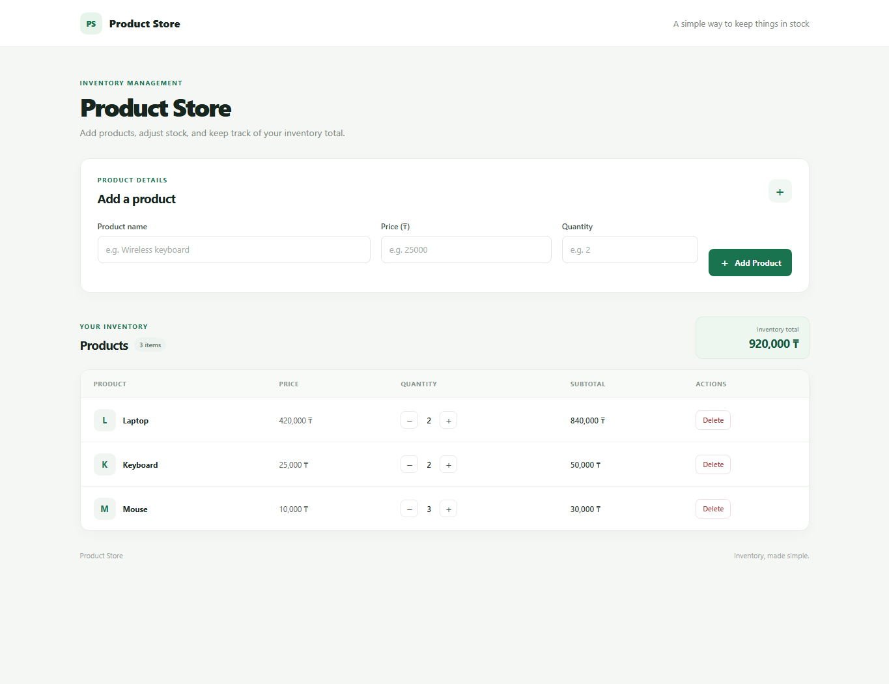

# DOM Store Management

## How to open

Open `index.html` directly in a web browser. You can also open the project in Visual Studio Code and use the Live Server extension.

## What was implemented

The `submit` event validates the product name, price, and quantity before adding a product to the store. The `click` event handles product actions, and event delegation lets one listener on the products table handle every increase, decrease, and delete button. `DOMContentLoaded` runs the initial setup, loads the sample products, and renders the page. The live total recalculates after every inventory change without reloading the page.

## Screenshot

## AI Tools

ChatGPT was used to assist with code structure, debugging, and explanation.
